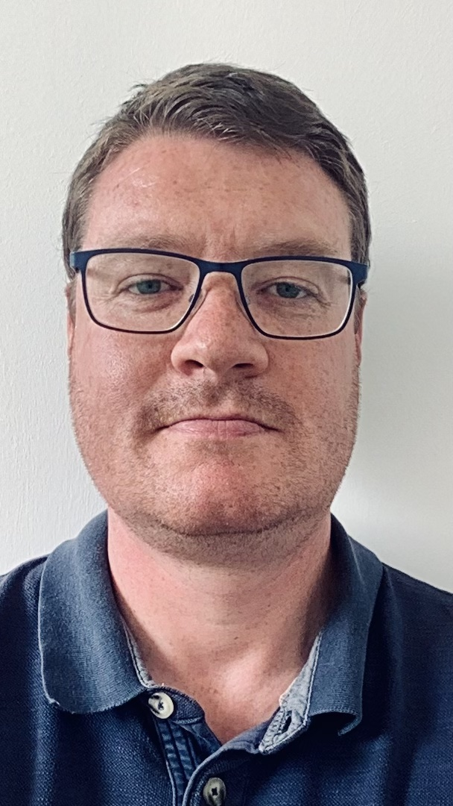

I am a **Principal Applied Scientist** within the *Automated Reasoning Group* at *Amazon Web Services*, Cambridge, UK (AWS, henceforth).
Prior to moving to AWS I was:

- A (**Senior**, then **Staff**, before finally being promoted to) **Principal Research Engineer** within the *Systems Group* at [*Arm Research*](https://www.arm.com/resources/research), Cambridge, UK from 2017&ndash;2022.
My research there focussed on privacy-preserving computation, as evidenced by the Confidential Computing Consortium-adopted [*Veracruz* project](https://github.com/veracruz-project/veracruz), a project which I initiated and thereafter acted as technical lead on.
Moreover, I also had a hand in developing software verification flows which provided strong evidence for the correctness for low-level, security-critical firmware, central to the *Arm Confidential Computing Architecture* ("Arm CCA").
This is a Confidential Computing technology that will be deployed as a point-release for the Armv9-A architecture, and will eventually be found in hundreds of millions of devices worldwide.
- A **Postdoctoral Research Scientist** (a "postdoc"), from 2012&ndash;2017, at the [*Computer Laboratory* at the *University of Cambridge*](https://www.cl.cam.ac.uk).
Here, I worked on [Prof. Peter Sewell's](https://www.cl.cam.ac.uk/~pes20/) [*Rigorous Engineering for Mainstream Systems* ("REMS") project](https://www.cl.cam.ac.uk/~pes20/rems/).
I helped develop the Lem specification language, and developed a formal semantics of ELF static linking.
I also developed a side interest in the correctness of a class of distributed datastructure, called *Conflict-free Replicated Datatypes* ("CRDTs").
- A **Postdoctoral Research Scientist** (a "postdoc"), from 2010&ndash;2012, at the [*Dipartimento di Scienze dell'Informazione* at the *Alma Mater Studiorum, Università di Bologna*](https://disi.unibo.it).
I worked with [Dr. Claudio Sacerdoti Coen](https://www.unibo.it/sitoweb/claudio.sacerdoticoen/en) on the EU-funded [*Certified Complexity* ("CerCo") project](http://cerco.cs.unibo.it), which aimed to produce a certified compiler, for a large fragment of C, capable of automatically lifting precise and reliable concrete complexity bounds from machine code to the original input source code.
I worked on the implementation and verification of the CerCo C compiler backend, using the (now sadly defunct) [Matita proof assistant](http://matita.cs.unibo.it). 

I have a PhD in theoretical computer science from the [*Department of Mathematics and Computer Science* at *Heriot-Watt University*](https://www.hw.ac.uk/uk/schools/mathematical-computer-sciences.htm), Edinburgh.
I studied various topics at the intersection of nominal techniques, unification, and type-theory and lambda-calculi.
My supervisors were [Murdoch "Jamie" Gabbay](http://www.gabbay.org.uk) and [Phil Trinder](http://www.dcs.gla.ac.uk/~trinder/).

## Miscellanea

My [Erdős Number](https://en.wikipedia.org/wiki/Erdős_number) is *at most* four: me ⇒ Gilles Dowek ⇒ Nachum Dershowitz ⇒ Andreas R. Blass ⇒ Paul Erdős.
